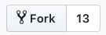
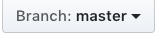

# 移动iOS导师分配(2018)
- - - -

* 我尽量给你们写的清楚一点|･ω･｀)
* **之前没有上课的同学也可以选择导师，上课的同学必须选择导师**
* 有问题先百度或者谷歌，实在不行群里问
* 周六晚12点截止
## 填写步骤
* 这一步骤已经默认你们安装了Git(其实这个并不需要你们安装，Xcode集成了)并注册了Github账号
1. fork（复制repository（仓库）到自己的账号上）
   * 点击右上方的fork按钮
	* 回到自己的账号首页你会发现首页多了一个repository	
2. 更改branch（分支）
	* 进入你帐号下的repository，点击branch按钮，选择develop分支
3. commit
	* 改动md文件，将你选择的导师后的xxx改成你自己的名字（这一步你可以clone到本地，再改动后commit，然后push，也可 以直接在网页上编辑）
4. pull request
	* 改动后回到仓库首页点击 New pull request的按钮
	* 看到绿色的Creat pull requset按钮了吗？点击它，填上申请理由。
	* 完成这一步你可以转到我的repository点击pull request按钮查看你的pull请求
	* 这一步完成后你就可以在群里炫耀进度了